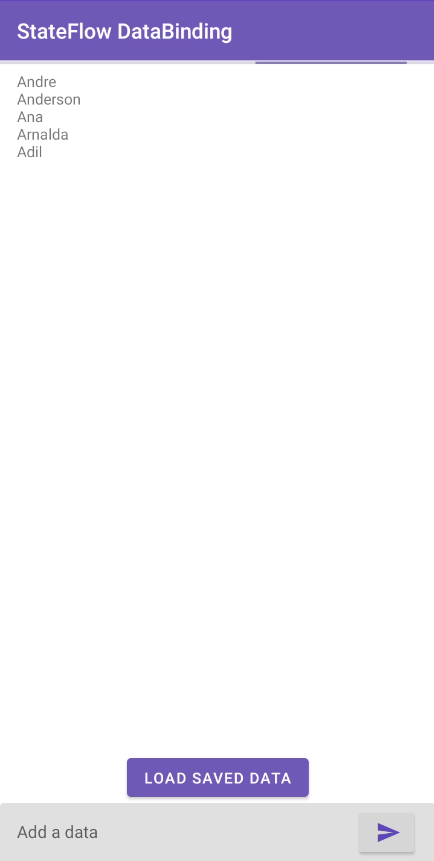

# Kotlin StateFlow DataBinding

## Coroutine + StateFlow:
*   Play MVVM with Kotlin Coroutines Flow
*   Load data with Kotlin Flow + MutableStateFlow
*   Using Kotlin Extensions to databinding
*   Custom Extension viewBinding to inflate layout's
*   ApiProvider Simulate Exception to Flow collect in catch

| List view state |
| --------------- |
| 